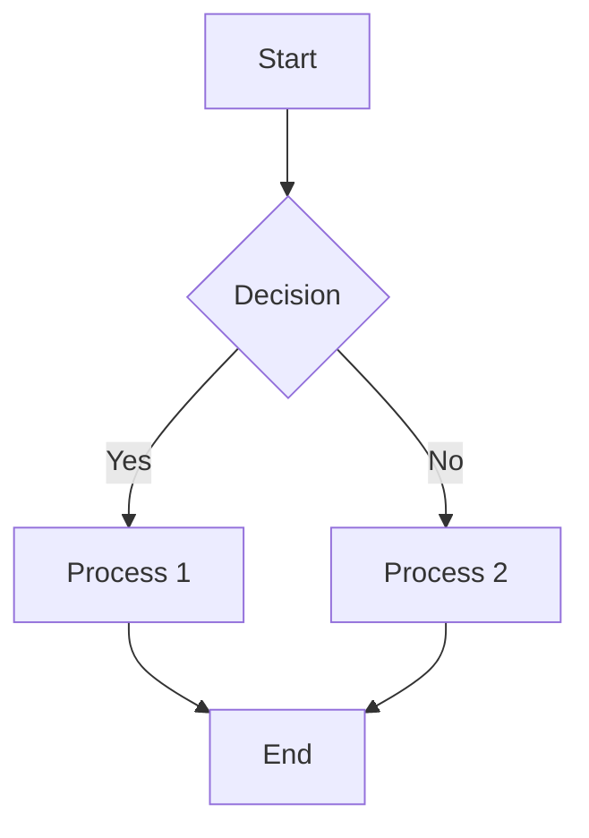
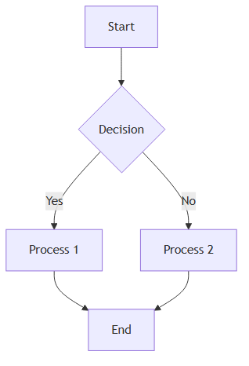
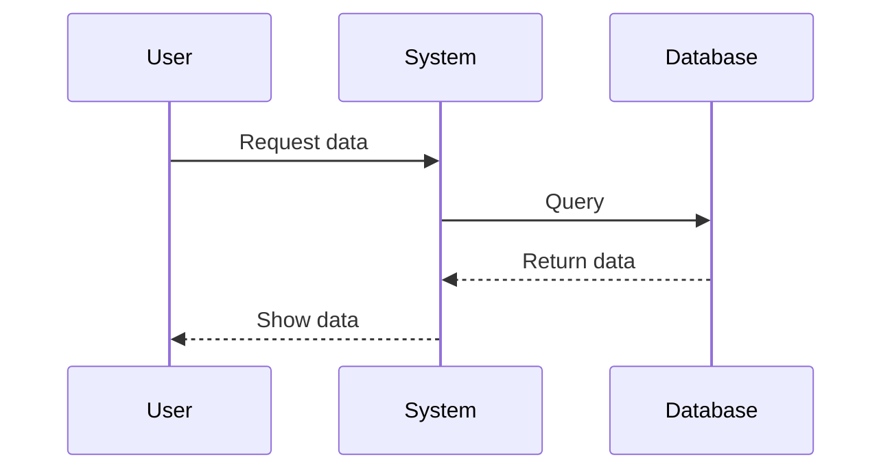
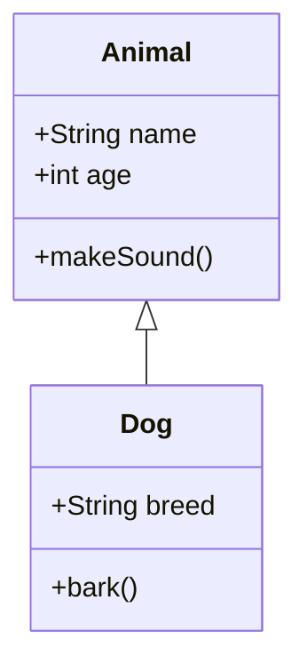
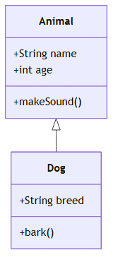
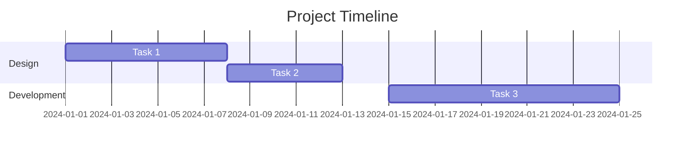
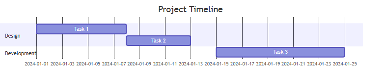

# Contoh Diagram Mermaid

## Flowchart

```mermaid
graph TD
    A[Start] --> B{Decision}
    B -->|Yes| C[Process 1]
    B -->|No| D[Process 2]
    C --> E[End]
    D --> E
```

## Sequence Diagram

```mermaid
sequenceDiagram
    participant User
    participant System
    participant Database

    User->>System: Request data
    System->>Database: Query
    Database-->>System: Return data
    System-->>User: Show data
```

## Class Diagram

```mermaid
classDiagram
    class Animal {
        +String name
        +int age
        +makeSound()
    }
    class Dog {
        +String breed
        +bark()
    }
    Animal <|-- Dog
```

## Gantt Chart

```mermaid
gantt
    title Project Timeline
    dateFormat  YYYY-MM-DD
    section Design
    Task 1 : 2024-01-01, 7d
    Task 2 : 2024-01-08, 5d
    section Development
    Task 3 : 2024-01-15, 10d
```

